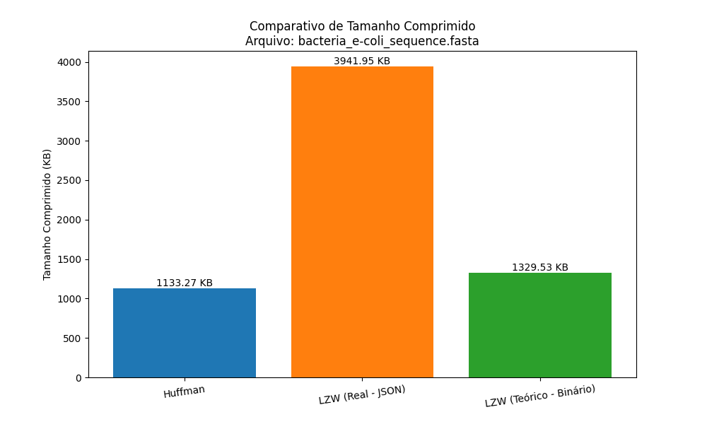
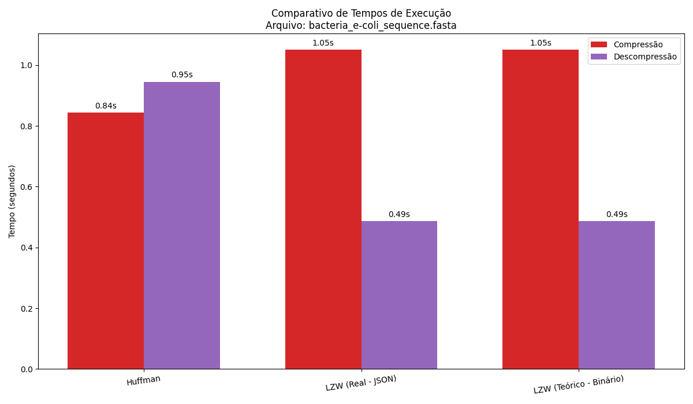

# Relatório de Análise Comparativa de Compressão

## Arquivo Analisado
- **Nome:** `bacteria_e-coli_sequence.fasta`
- **Tamanho Original:** 4597.69 KB
- **Total de Bases:** 4,641,652

## Tabela de Resultados

| Algoritmo | Tamanho Comprimido (KB) | Taxa de Compressão (%) | Tempo Compressão (s) | Tempo Descompressão (s) |
|---|---|---|---|---|
| **Huffman** | 1133.27 | 75.35 | 0.8200 | 1.0655 |
| **LZW (Real - JSON)** | 3941.95 | 14.26 | 1.2105 | 0.4808 |
| **LZW (Teórico - Binário)** | 1329.53 | 71.08 | 1.2105 | 0.4808 |

## Métricas Avançadas e Análise Teórica

### Análise do Algoritmo Huffman

- **Entropia de Shannon:** `1.9998` bits/símbolo
  - *Significado: Representa o **limite teórico** da compressão para este arquivo. É o número mínimo de bits, em média, necessários para representar cada caractere com base em suas frequências.*

- **Comprimento Médio do Código:** `2.0000` bits/símbolo
  - *Significado: Representa o **desempenho real** da nossa implementação. Um valor próximo da entropia indica uma compressão Huffman de altíssima eficiência, mostrando que o algoritmo se aproximou do ótimo teórico.*

### Análise do Algoritmo LZW

- **Tamanho Final do Dicionário:** `544,831` entradas
  - *Significado: Indica quantos padrões únicos e sequências repetitivas o algoritmo 'aprendeu'. Um número maior sugere que o arquivo possui uma estrutura com mais repetições que podem ser exploradas.*

- **Taxa de Redução de Símbolos:** `8.52`
  - *Significado: Mostra, em média, quantos caracteres do texto original foram representados por **um único código LZW**. Um valor maior é um forte indicador de alta eficiência de compressão.*

## Gráficos Comparativos

### Comparativo de Tamanho Final

### Comparativo de Tempos de Execução

