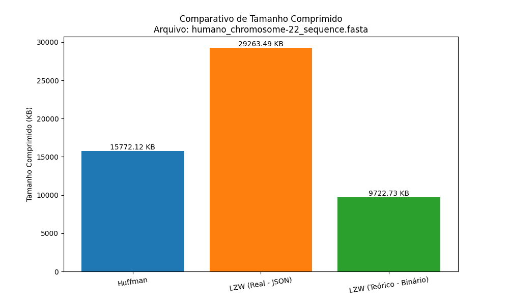
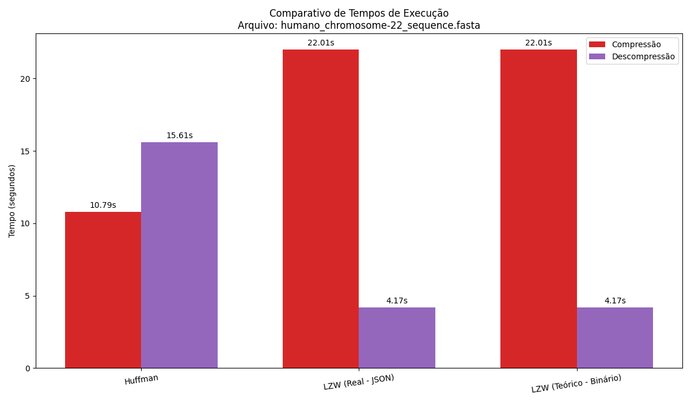

# Relatório de Análise Comparativa de Compressão

## Arquivo Analisado
- **Nome:** `humano_chromosome-22_sequence.fasta`
- **Tamanho Original:** 50336.44 KB
- **Total de Bases:** 50,818,468

## Tabela de Resultados

| Algoritmo | Tamanho Comprimido (KB) | Taxa de Compressão (%) | Tempo Compressão (s) | Tempo Descompressão (s) |
|---|---|---|---|---|
| **Huffman** | 15772.12 | 68.67 | 10.7913 | 15.6051 |
| **LZW (Real - JSON)** | 29263.49 | 41.86 | 22.0065 | 4.1745 |
| **LZW (Teórico - Binário)** | 9722.73 | 80.68 | 22.0065 | 4.1745 |

## Gráficos Comparativos

### Comparativo de Tamanho Final

### Comparativo de Tempos de Execução

