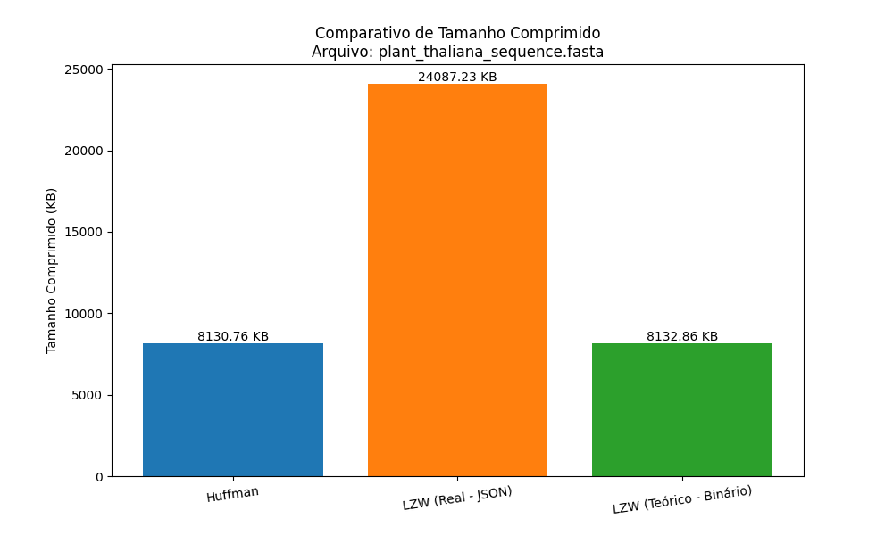
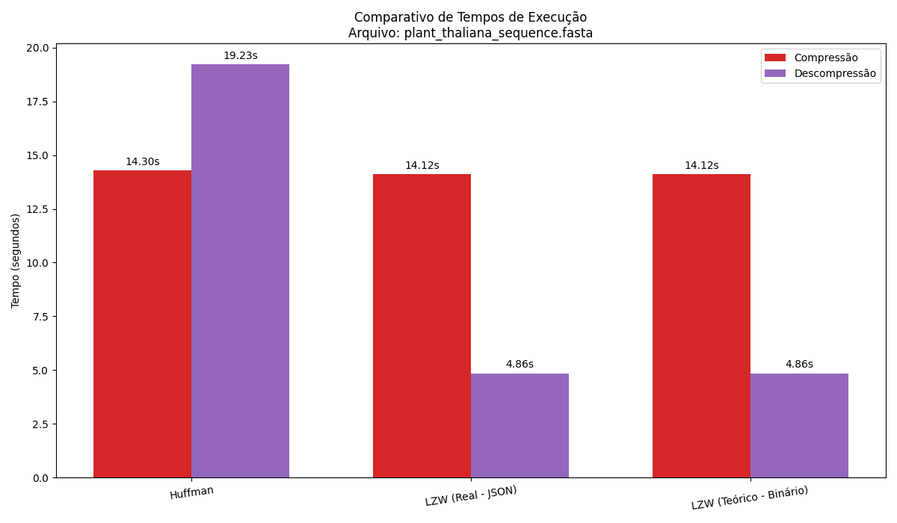

# Relatório de Análise Comparativa de Compressão

## Arquivo Analisado
- **Nome:** `plant_thaliana_sequence.fasta`
- **Tamanho Original:** 30139.07 KB
- **Total de Bases:** 30,427,671

## Tabela de Resultados

| Algoritmo | Tamanho Comprimido (KB) | Taxa de Compressão (%) | Tempo Compressão (s) | Tempo Descompressão (s) |
|---|---|---|---|---|
| **Huffman** | 8130.76 | 73.02 | 14.2964 | 19.2263 |
| **LZW (Real - JSON)** | 24087.23 | 20.08 | 14.1241 | 4.8600 |
| **LZW (Teórico - Binário)** | 8132.86 | 73.02 | 14.1241 | 4.8600 |

## Gráficos Comparativos

### Comparativo de Tamanho Final

### Comparativo de Tempos de Execução

