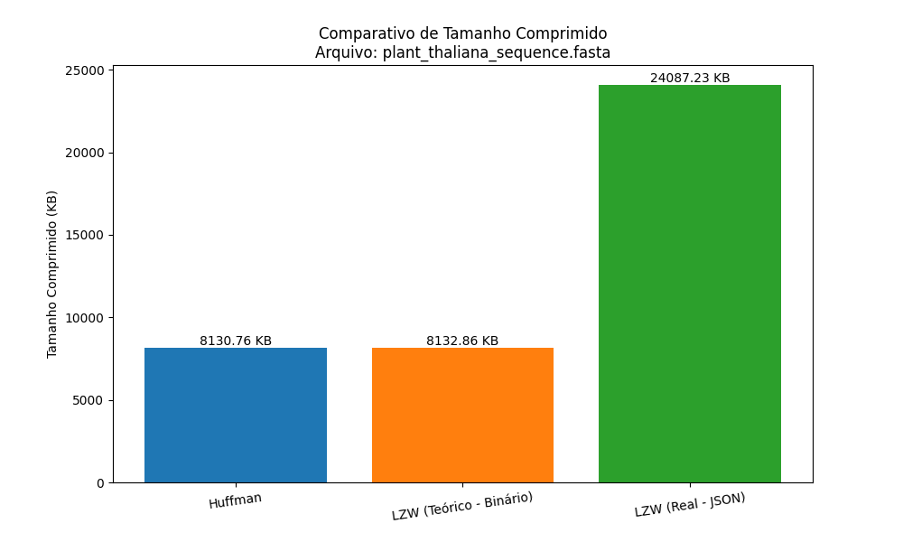
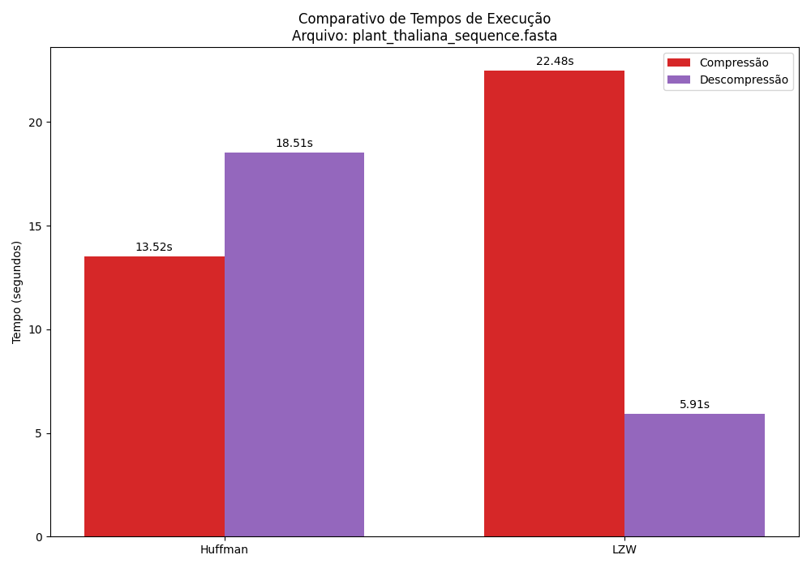

# Relatório de Análise Comparativa de Compressão

## Arquivo Analisado
- **Nome:** `plant_thaliana_sequence.fasta`
- **Tamanho Original:** 30563.57 KB
- **Total de Bases:** 30,427,671

## Tabela de Resultados

| Algoritmo | Tamanho Comprimido (KB) | Taxa de Compressão (%) | Tempo Compressão (s) | Tempo Descompressão (s) |
|---|---|---|---|---|
| **Huffman** | 8130.76 | 73.40 | 5.2485 | 6.8645 |
| **LZW (Teórico - Binário)** | 8132.86 | 73.39 | 9.8323 | 3.0631 |
| **LZW (Real - JSON)** | 24087.23 | 21.19 | --- | --- |

## Métricas Avançadas e Análise Teórica

### Análise do Algoritmo Huffman

- **Entropia de Shannon:** `1.9798` bits/símbolo
  - *Significado: Representa o **limite teórico** da compressão para este arquivo. É o número mínimo de bits, em média, necessários para representar cada caractere com base em suas frequências.*

- **Comprimento Médio do Código:** `2.1890` bits/símbolo
  - *Significado: Representa o **desempenho real** da nossa implementação. Um valor próximo da entropia indica uma compressão Huffman de altíssima eficiência, mostrando que o algoritmo se aproximou do ótimo teórico.*

### Análise do Algoritmo LZW

- **Tamanho Final do Dicionário:** `3,028,635` entradas
  - *Significado: Indica quantos padrões únicos e sequências repetitivas o algoritmo 'aprendeu'. Um número maior sugere que o arquivo possui uma estrutura com mais repetições que podem ser exploradas.*

- **Taxa de Redução de Símbolos:** `10.05`
  - *Significado: Mostra, em média, quantos caracteres do texto original foram representados por **um único código LZW**. Um valor maior é um forte indicador de alta eficiência de compressão.*

## Análise de Complexidade de Espaço (Uso de Memória)

A seguir, uma análise do uso de memória das principais estruturas de dados de cada algoritmo.

### Huffman

- **Overhead (Tamanho do Cabeçalho):** `0.12` KB
  - *Significado: Representa o custo de espaço fixo do Huffman. É o tamanho da tabela de frequências que precisa ser armazenada junto com os dados para permitir a descompressão. Este valor é geralmente muito pequeno e independe do tamanho do arquivo.*

### LZW

- **Estrutura Principal (Dicionário):** `3,028,635` entradas, ocupando uma memória estimada de **`236752.48` KB**
  - *Significado: Representa o custo de espaço dinâmico do LZW. O dicionário cresce à medida que o algoritmo processa o arquivo, consumindo memória proporcional à quantidade e ao tamanho dos padrões encontrados.*

## Gráficos Comparativos

### Comparativo de Tamanho Final

### Comparativo de Tempos de Execução

